<h1 align="center">Nessus Vulnerability Management Lab</h1>

<h2>Description</h2>

  I installed and configured Nessus Essentials to perform credentialed vulnerability scans against Windows 10 Hosts.

---

<h2>Languages and Utilities Used</h2>

<ul>
  <li><b>Nessus</b></li>
  <li><b>VMware Workstation</b></li>
</ul>

<h2>Environments Used</h2>

<ul>
  <li><b>Windows 10</b></li>
</ul>

---

<h2 align="center">Program Walkthrough</h2>

Create a virtual machine through VMware Workstation. For network adapter, select bridged. If you are not on ethernet, remove any bridging settings with ethernet  
 
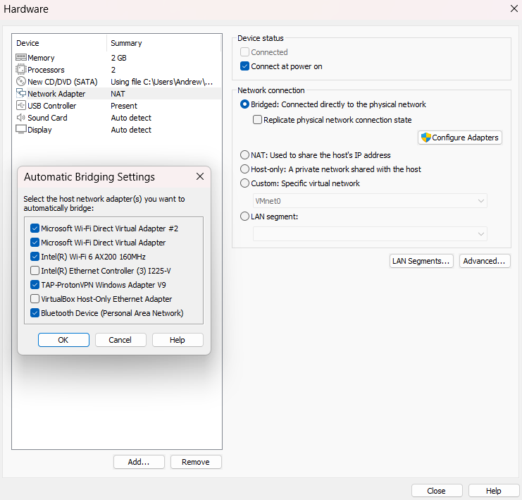

  

Once running, shut off the firewall and ping it with your machine to ensure connectivity  
 
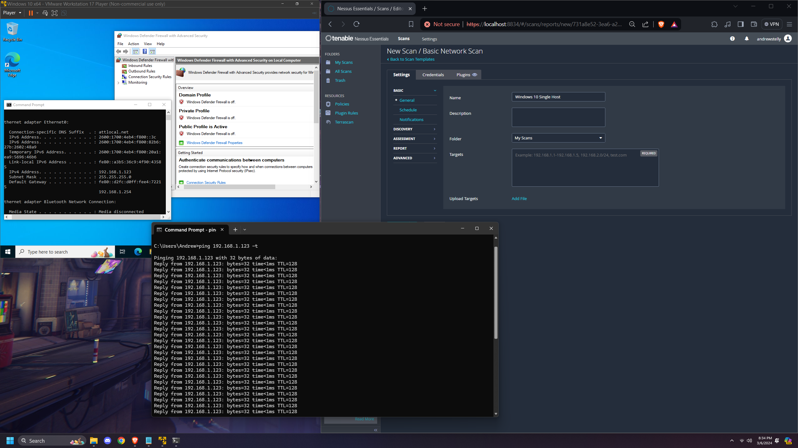

  

Create a new scan with Nessus and for the target, input the VM IP address  
 
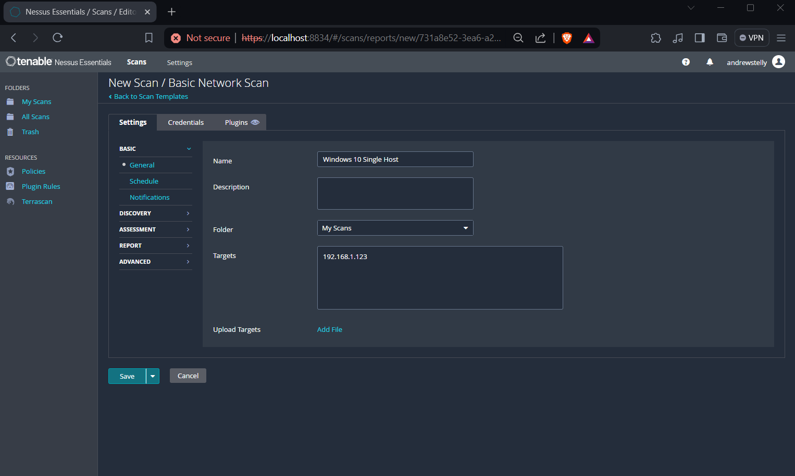

  

The scan can be configured to your needs. I will be running a common port scan  
 
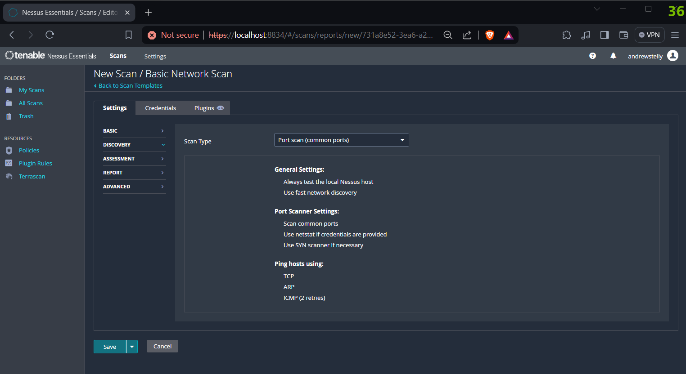

  

Save and run the scan  
 
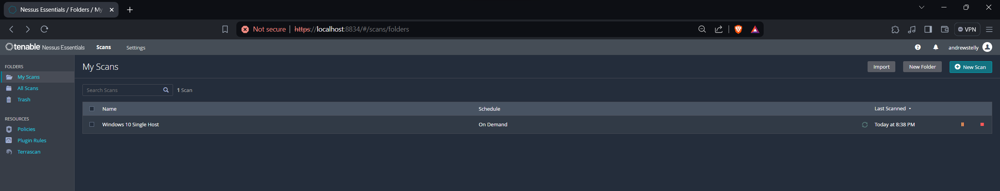

  

Once complete, you can review the vulnerabilities tab  
 
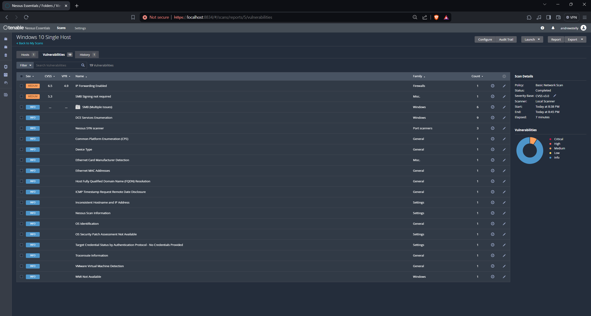

  

When clicking on a vulnerability, you will see more details about it and what you can do to remediate it  
 
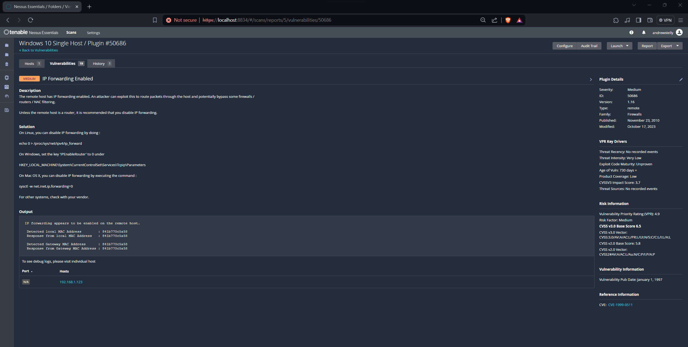

  

We will now do a credentialed scan. Go to services.msc and enable remote registry  
 
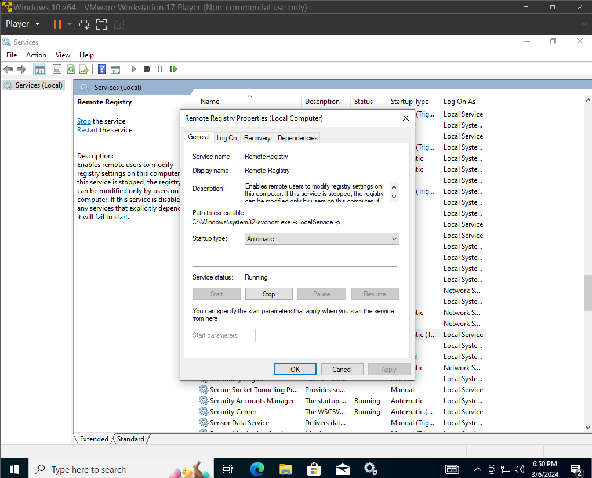

  

Make sure that file and printer sharing is on in Advanced sharing settings  
 
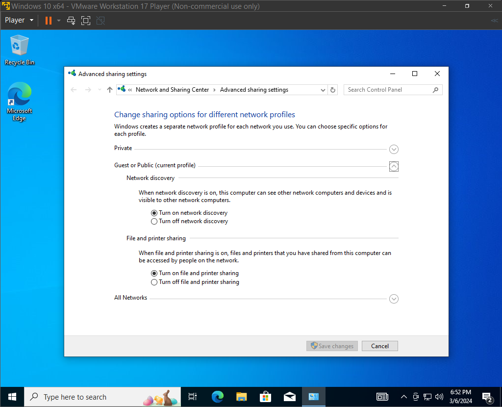

  

Disable User Account Control (This is not usually recommended, but we are not on the domain, so we have to disable it to complete the scan)  
 

  

Navigate to:  
`HKEY_LOCAL_MACHINE\SOFTWARE\Microsoft\Windows\CurrentVersion\Policies\System`  
Add `LocalAccountTokenFilterPolicy` as a `DWORD (32-bit)` value, set to `1`, then restart the VM.  
 
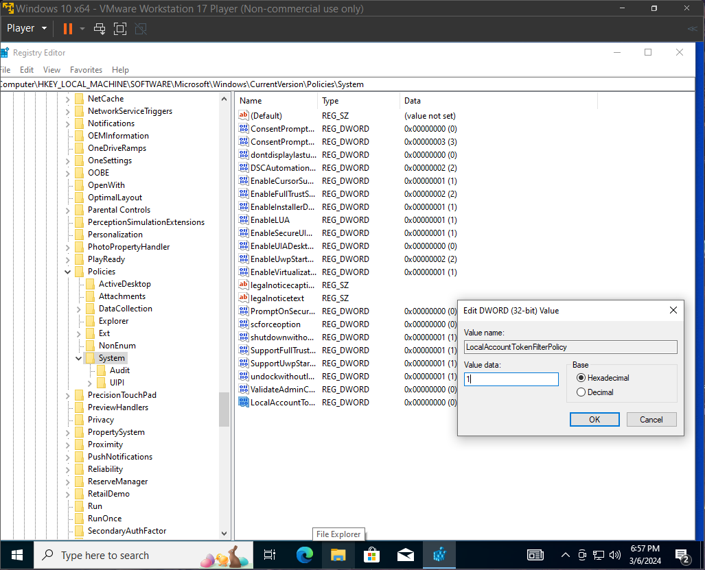

  

Go back to Nessus. Configure your Windows 10 Host. Go to credentials and add the username and password for the VM. Restart the scan  
 

  

When the scan is complete, we can see the list of vulnerabilities and their severity level  
 
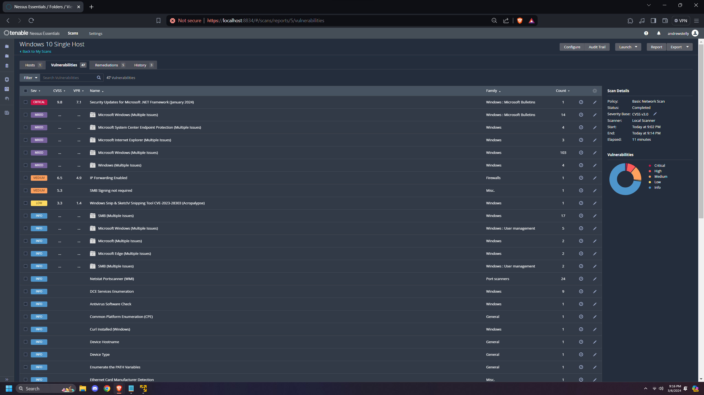

  

There is also a tab for remediations. (Automated patching can solve most of the errors)  
 
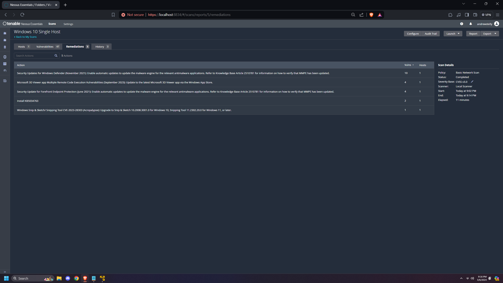

  

To further test the capabilities of Nessus, we will install an old version of Firefox and run a new scan  
 
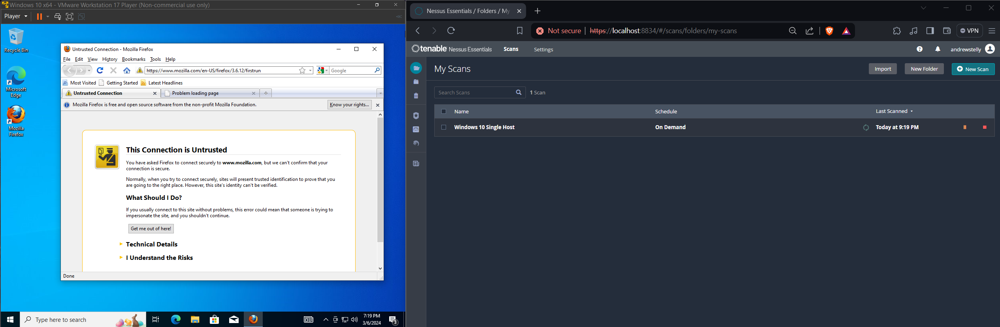

  

We can see that Mozilla Firefox has many critical issues (177 vulnerabilities)  
 
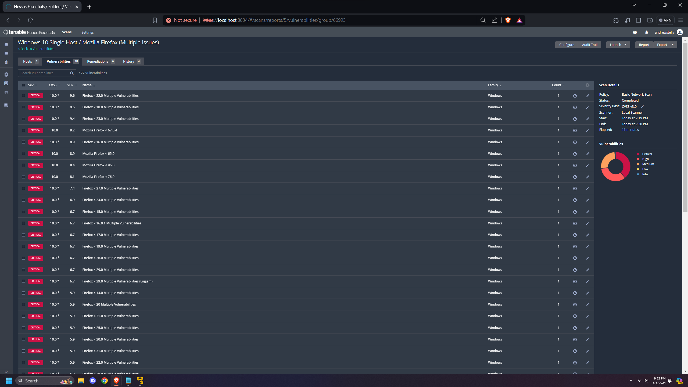

  

To remediate some of our vulnerabilities, we can uninstall Firefox and update Windows. After running another scan, we can see that there are fewer vulnerabilities  
 
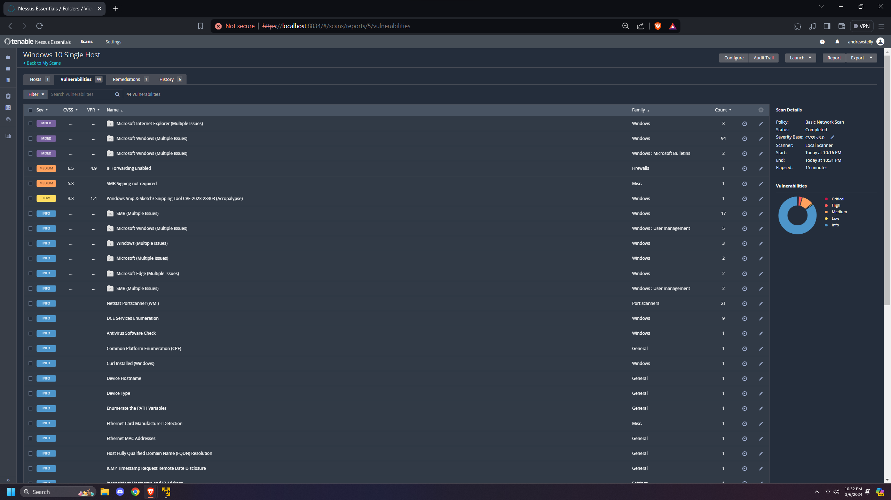

