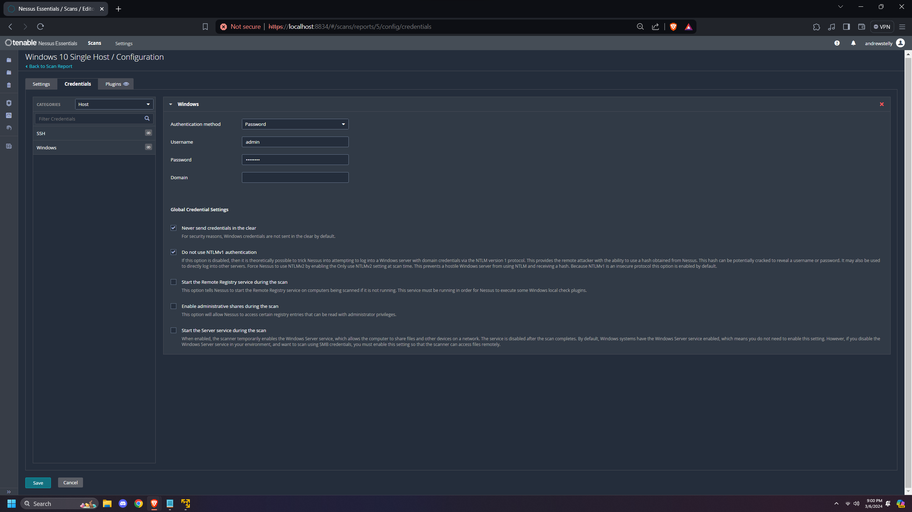

# Nessus Vulnerability Management Lab

## Description  
Installed and configured **Nessus Essentials** to perform credentialed vulnerability scans against Windows 10 hosts.

---

## Languages and Utilities Used  
- **Nessus**  
- **VMware Workstation**

## Environments Used  
- **Windows 10**

---

## Program Walkthrough

### Create VM and Configure Network

  

### Verify Connectivity

  

### Start Nessus Scan Setup

  

### Configure Scan

  

### Run the Scan

  

### Review Vulnerability Tab

  

### Investigate Vulnerabilities

  

## Credentialed Scan Setup

### Enable Remote Registry

  

### Enable File and Printer Sharing

  

### Disable User Account Control (UAC)

  

### Registry Tweak for Credentialed Scan  
Navigate to:  
`HKEY_LOCAL_MACHINE\SOFTWARE\Microsoft\Windows\CurrentVersion\Policies\System`  
Add `LocalAccountTokenFilterPolicy` as a `DWORD (32-bit)` value, set to `1`, then restart the VM.  

  

### Add Credentials in Nessus

  

### Run Credentialed Scan

  

### Vulnerability Results with Severity

  

### Review Remediation Suggestions

  

## Additional Testing

### Install Old Firefox

  

### Observe Vulnerability Spike

  

## Final Notes  
After uninstalling Firefox and updating Windows, a re-scan shows significantly fewer vulnerabilities, confirming successful remediation.
